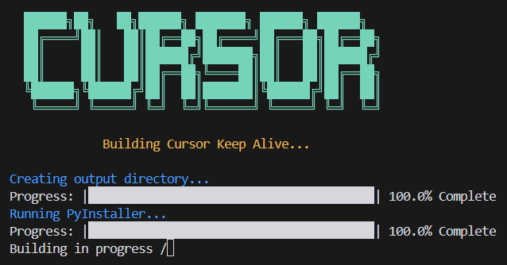
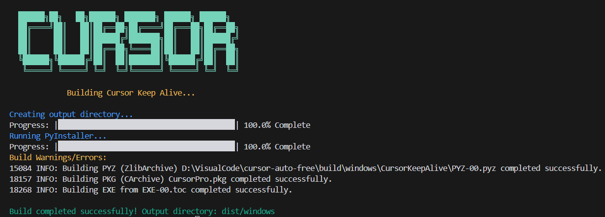

# Cursor Pro 自动化工具

[简体中文](README.md) | [繁體中文](README_zh_TW.md) | [English](README_en.md)

<p align="center">
  
</p>

## 🚀 功能介绍
自动注册账号，自动刷新本地token，解放双手。

## ⬇️ 下载地址
https://github.com/chengazhen/cursor-auto-free/releases

## ⚠️ 重要提示
1. **确保已安装 Chrome 浏览器**
   - 如果未安装，请从[官方网站下载](https://www.google.com/intl/en_pk/chrome/)

2. **必须先完成账号登录**
   - 不论账号是否有效，必须先完成登录步骤

3. **网络要求**
   - 需要稳定的网络连接
   - 建议使用国外节点
   - ⚠️ 切勿开启全局代理

## 🛠️ 构建使用
### Win / Mac / Linux 通用

<p align="center">
  
  
</p>

```bash
# 根据您的操作系统选择以下任一方式构建：
Windows: build.bat
macOS:   build.mac.command
Linux:   build.sh
```

## 📱 运行方法

### macOS
1. 打开终端，进入应用目录
2. 授权执行权限：
```bash
chmod +x ./CursorPro
```
3. 运行程序：
```bash
./CursorPro
```
或直接在访达（Finder）中双击运行

> 💡 如遇到启动问题，请参考[解决方案](https://sysin.org/blog/macos-if-crashes-when-opening/)

<p align="center">
  
</p>

### Windows
直接双击运行 `CursorPro.exe`

## ✅ 验证方法
运行脚本完成后，重启编辑器，确认账号信息与脚本输出日志一致：

<p align="center">
  
</p>

## 📝 使用注意事项

1. **运行环境要求**
   - 稳定的网络连接
   - 足够的系统权限

2. **使用过程中**
   - 请勿手动关闭浏览器窗口
   - 耐心等待程序自动完成操作
   - 看到"脚本执行完毕"提示后再关闭程序

## ❓ 常见问题解决

1. **程序运行卡住**
   - 检查网络连接
   - 重启程序重试

## ⚖️ 免责声明
本工具仅供学习研究使用，请遵守相关服务条款。使用本工具产生的任何后果由使用者自行承担。

---

> 仓库源码来自开源；自行优化了验证和邮箱注册逻辑；解决了无法获取邮箱验证码的问题。
