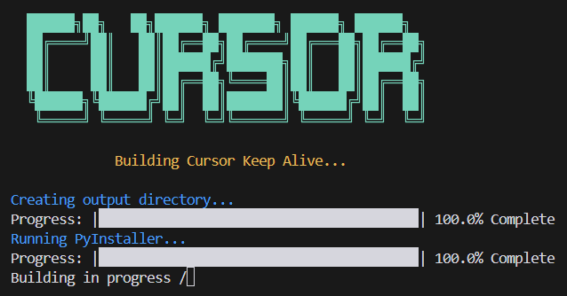

# Cursor Pro Automation Tool

[简体中文](README.md) | [繁體中文](README_zh_TW.md) | [English](README_en.md)

<p align="center">
  
</p>

## 🚀 Features
Automatic account registration and local token refresh, hands-free operation.

## ⬇️ Download
https://github.com/chengazhen/cursor-auto-free/releases

## ⚠️ Important Notes
1. **Ensure Chrome Browser is Installed**
   - If not installed, download from [Official Website](https://www.google.com/intl/en_pk/chrome/)

2. **Account Login Required**
   - Must complete login first, regardless of account validity

3. **Network Requirements**
   - Stable internet connection required
   - International network node recommended
   - ⚠️ Do not enable global proxy

## 🛠️ Build Instructions
### For Win / Mac / Linux

<p align="center">
  
  
</p>

```bash
# Choose the appropriate build method for your OS:
Windows: build.bat
macOS:   build.mac.command
Linux:   build.sh
```

## 📱 Running Instructions

### macOS
1. Open terminal and navigate to application directory
2. Grant execution permissions:
```bash
chmod +x ./CursorPro
```
3. Run the program:
```bash
./CursorPro
```
Or double-click in Finder to run

> 💡 If you encounter startup issues, check the [Solution Guide](https://sysin.org/blog/macos-if-crashes-when-opening/)

<p align="center">
  
</p>

### Windows
Double-click `CursorPro.exe` to run

## ✅ Verification
After running the script, restart your editor and verify that the account information matches the script output log:

<p align="center">
  
</p>

## 📝 Usage Notes

1. **System Requirements**
   - Stable network connection
   - Sufficient system permissions

2. **During Operation**
   - Do not manually close browser windows
   - Wait patiently for automatic completion
   - Close program only after seeing "Script Execution Complete"

## ❓ Troubleshooting

1. **Program Freezes**
   - Check network connection
   - Restart the program

## ⚖️ Disclaimer
This tool is for learning and research purposes only. Please comply with relevant terms of service. Users assume all responsibility for any consequences of using this tool.

---

> Repository source code is open-source; verification and email registration logic optimized; fixed email verification code retrieval issues. 